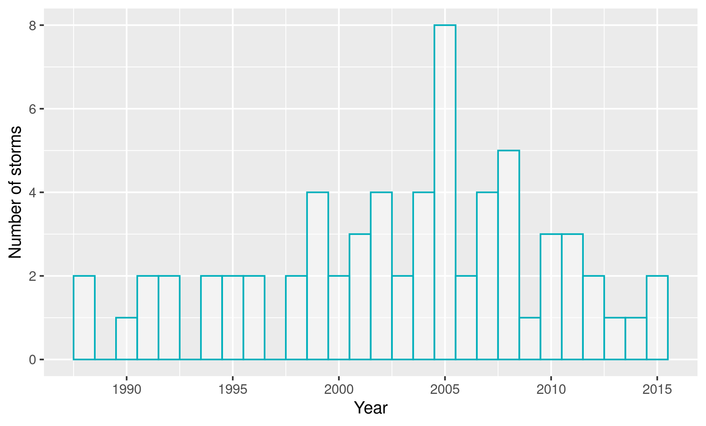
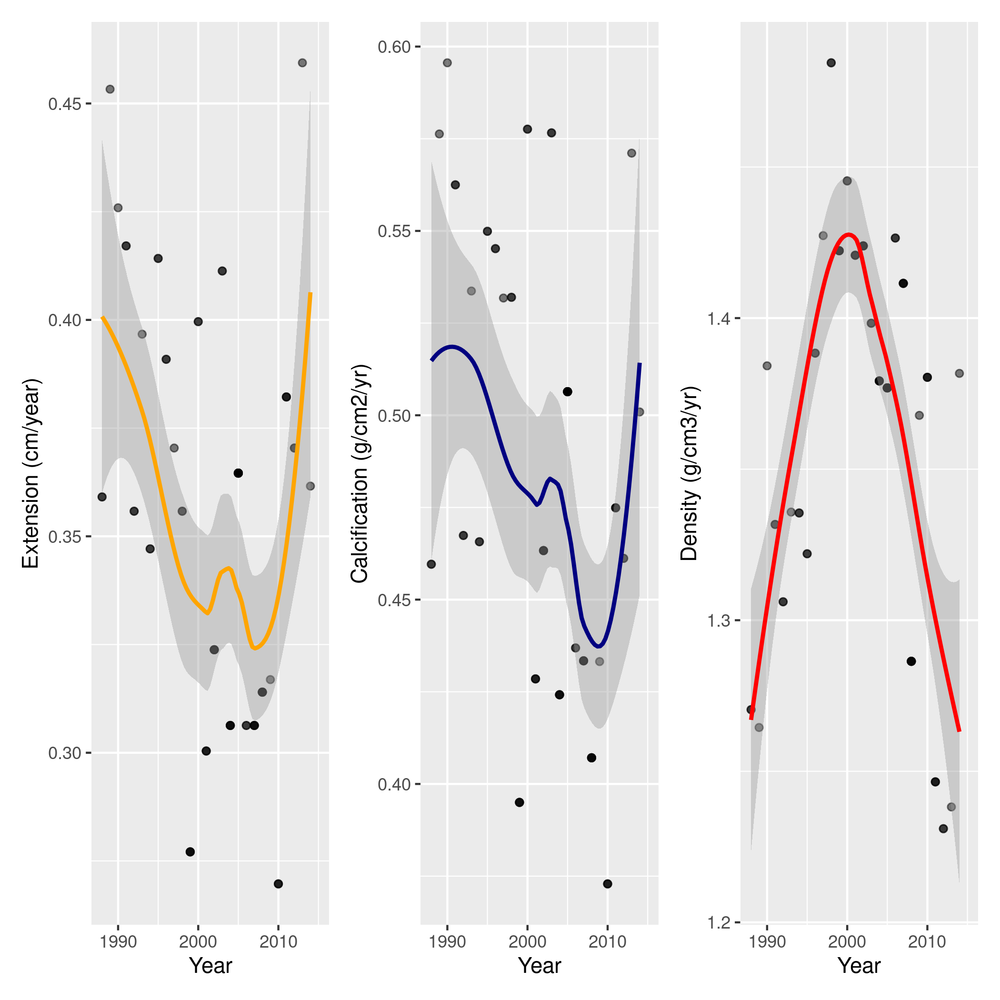

### Proposal for BIOS 611 Project 1

______

#### 1. A description of the data set.

There are two datasets involved in this analysis. The first is data associated with one coral "core" collected from the Florida Keys in 2014. The analysis of coral cores is similar to that of analyzing the rings on a tree - they provide information about a coral's annual growth over time. This dataset includes linear extension data, calcification, and skeletal density for each year since 1890. By comparing historical coral growth to environmental data, we can better understand the relationship between the environmental conditions at a given point in history and variations in coral growth. Along this same vein, the second dataset that I am using is of all storms that came within 500km of this coral core since 1988 (although there is some less detailed data available for earlier years if I decide I want to explore it). This dataset also includes other values such as wind speed, storm radius, etc.

This data set was obtained from my research advisor, so I'm excited to explore it and potentially contribute to our understanding of the effect of storms on coral growth.

#### Some preliminary figures.

**Let's first find out how the frequency of storms has varied from 1988-2015.**

From 1988-1998, it seems like there were no more than 2 storms/year coming in vicinity of this particular coral, and some years there were no storms at all. We start to see a gradual increase in the frequency of storms, with a whopping 8 storms coming in vicinity of the coral in 2005! Since 1997 there hasn't been one year with 0 storms coming near this coral. However, it seems like there has been a decrease since 2005. Maybe there was a unique atmospheric event around 2005 that led to an increase in storm frequency? Or maybe this is just an outlier.

**Let's overlay storm category, which is a measure of strength based upon the sea level pressure of the storm, on the histogram above.**

It seems like the frequency of higher category storms increased slightly in the early 2000s. 

**I'd like to see if the increase in storm frequency/intensity in the early 2000s had an impact on coral growth.**

**First, I'll plot the change in density, calcification, and linear extension over time (1890-2014).**

It looks like after around 1975, there's a decrease in all three variables. My guess is this likely has more to do with thermal stress than storms, but let's zoom in to 1990-2015. In addition, the fit of the line above is likely not that strong looking at the dispersion of the points.

**It might be more useful to view this data by the change in each of the growth variables per year.**

No clear patterns in the plots above.

**Zooming in on data since 1988** (dates that we have both growth and storm data)

Calcification and extension dipped from 1988 to ~2008, before increasing again. Calcification, interestingly, increased from 1988 to ~2000, before falling steadily until 2015. The sort of inverse relationship between extension/calcification and density is in line with previous findings from the Castillo lab - for example, a 2018 paper from the lab showed the same trend for two corals from the Caribbean over the last century (this is not really seem to be in line with the longer term figures shown above, but is in line with the three plots directly above). Interesting! 

An interesting question from here would be to see if the dips in extension/calcification we see shortly after 2000 and right before 2010 are related to the storm data. In the next steps of my project, I'd like to explore this question further. Since the histogram of the storm data above showed a higher number and strength of storms in 2000 and 2005, maybe the dips above are indicative of delayed effects (in the few years after storm disturbance). I also might be able to get some more data (more coral samples, longer term storm data) to see if this trend holds for other samples. It would also be cool to implement some machine learning techniques to see if there are any predictors of coral growth in the storm data. It would also be great to get a better index of intensity + distance from coral but I'm not really sure how to do that - might be worth looking at the literature and seeing if anyone has come up with something like this.

